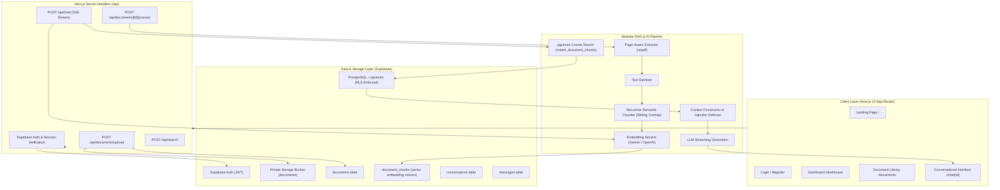

# 📚 Chat With Your Docs — Production AI & RAG Document Intelligence Platform

[](https://nextjs.org/)
[](https://react.dev/)
[](https://www.typescriptlang.org/)
[](https://tailwindcss.com/)
[](https://supabase.com/)
[](https://github.com/pgvector/pgvector)
[](https://ai.google.dev/)
[](https://openai.com/)

> **Chat With Your Docs** is a full-stack, enterprise-grade AI document question-answering platform. Authenticated users upload their own private documents (PDF, TXT, Markdown) and converse with them in real-time. Answers are synthesized using Retrieval-Augmented Generation (RAG) powered by dense vector embeddings in PostgreSQL `pgvector`, with verifiable page-level citations and zero hallucination guardrails.

---

## 🌟 Key Features

- **True Semantic Search**: Uses high-dimensional dense embeddings (`text-embedding-004` / `text-embedding-3-small`) with cosine similarity indexing in PostgreSQL `pgvector`.
- **Page-Aware PDF & Text Parsing**: Zero-dependency `unpdf` page-by-page extraction preserves exact page boundaries for verifiable inline citations.
- **Strict Anti-Hallucination Grounding**: The LLM is constrained to retrieved evidence. If facts are absent, it returns the standard message: *"I couldn't find enough information about this in the uploaded documents."*
- **Prompt Injection Defense**: Untrusted user documents are isolated in delimited context blocks so embedded malicious instructions cannot hijack system prompts.
- **Real-Time Streaming Responses**: Token-by-token streaming using Server-Sent Events (SSE) with progressive markdown rendering and copy-to-clipboard actions.
- **Row-Level Security (RLS)**: Every document, chunk, conversation, and vector query is mathematically isolated to the authenticated user.
- **Interactive Multi-Turn Chat**: Multi-turn conversation awareness with document-scoped or global-library search.
- **Dark & Light Mode**: Clean, responsive UI built with Tailwind CSS, Lucide icons, and full mobile/tablet optimization.

---

## 🏗️ Architecture



---

## 🚀 Quick Start & Setup

### 1. Clone & Install Dependencies
```bash
git clone https://github.com/your-username/chat-with-your-docs.git
cd chat-with-your-docs
npm install
```

### 2. Configure Environment Variables
Copy `.env.example` to `.env.local`:
```bash
cp .env.example .env.local
```

Fill in your Supabase credentials and Gemini/OpenAI API keys:
```env
NEXT_PUBLIC_SUPABASE_URL=https://your-project.supabase.co
NEXT_PUBLIC_SUPABASE_ANON_KEY=eyJhbGciOiJIUzI1NiIsInR5cCI6IkpXVCJ9...
SUPABASE_SERVICE_ROLE_KEY=eyJhbGciOiJIUzI1NiIsInR5cCI6IkpXVCJ9...

LLM_PROVIDER=gemini
GEMINI_API_KEY=AIzaSy...
GEMINI_MODEL=gemini-1.5-flash
GEMINI_EMBEDDING_MODEL=text-embedding-004

VECTOR_DIMENSION=768
RAG_TOP_K=5
RAG_SIMILARITY_THRESHOLD=0.2
```

### 3. Run Database Migration
Execute `supabase/migrations/20240101000000_init_schema.sql` in your Supabase project's SQL Editor.

### 4. Run the Application
```bash
# Start development server
npm run dev

# Run automated test suite
npm test

# Verify type safety
npx tsc --noEmit
```
Open [http://localhost:3000](http://localhost:3000) in your browser.

---

## 📁 Project Structure

```
chat-with-your-docs/
├── src/
│   ├── app/
│   │   ├── page.tsx                    # Marketing landing page
│   │   ├── layout.tsx                  # Root layout & Navbar
│   │   ├── globals.css                 # Custom CSS & Tailwind
│   │   ├── login/                      # Login page
│   │   ├── register/                   # Registration page
│   │   ├── dashboard/                  # Main analytics dashboard
│   │   ├── documents/                  # Document management & detail
│   │   ├── chat/                       # Conversational chat interface
│   │   ├── settings/                   # User & AI preferences
│   │   └── api/
│   │       ├── documents/              # Upload, process, list, delete
│   │       ├── chat/                   # Streaming RAG SSE endpoint
│   │       ├── search/                 # Raw vector search endpoint
│   │       └── conversations/          # CRUD conversations & history
│   ├── components/
│   │   ├── layout/                     # Navbar, ThemeToggle
│   │   ├── documents/                  # UploadZone, DocumentList
│   │   └── chat/                       # ChatWindow, SourceCard, ChatLayout
│   ├── lib/
│   │   ├── supabase/                   # Client, Server, Admin Supabase SDKs
│   │   ├── ai/                         # EmbeddingService, LLMService (Gemini & OpenAI)
│   │   ├── documents/                  # Extractor (unpdf), Cleaner, Chunker
│   │   ├── rag/                        # VectorSearch, ContextBuilder
│   │   ├── validation/                 # Zod validation schemas
│   │   └── auth/                       # Server session resolver
│   ├── types/                          # TypeScript definitions
│   └── middleware.ts                   # Session refresh & route protection
├── supabase/
│   └── migrations/                     # PostgreSQL schema with pgvector & RLS
├── tests/
│   ├── fixtures/                       # Test documents
│   ├── unit/                           # Cleaner, Chunker, Context, Schema tests
│   └── integration/                    # End-to-end RAG pipeline tests
└── docs/
    ├── architecture.md                 # System architecture guide
    ├── setup.md                        # Local setup & deployment guide
    ├── api.md                          # REST API specification
    └── rag-pipeline.md                 # In-depth RAG & grounding documentation
```

---

## 🧪 Testing Suite

Run the full automated test suite using Vitest:
```bash
npm test
```

Included tests:
- `tests/unit/cleaner.test.ts`: Validates control character sanitization and structural markdown preservation.
- `tests/unit/chunker.test.ts`: Verifies recursive splitting, sliding overlap, chunk indexing, and page number tracking.
- `tests/unit/contextBuilder.test.ts`: Verifies source citations formatting, prompt injection defense, and grounding fallbacks.
- `tests/unit/schemas.test.ts`: Tests file size restrictions, allowed MIME types, and chat request validation.
- `tests/integration/ragPipeline.test.ts`: End-to-end integration test validating ingestion from text files to vector chunks to RAG context.

---

## 🔒 Security & Privacy

1. **Zero Client Trust**: Server routes never trust client-supplied `user_id` values. The authenticated identity is extracted directly from the verified Supabase JWT session cookie.
2. **PostgreSQL Row-Level Security (RLS)**: RLS policies enforce `auth.uid() = user_id` across all tables (`documents`, `document_chunks`, `conversations`, `messages`).
3. **Private Storage Isolation**: File uploads are restricted to isolated folders `users/{userId}/documents/{documentId}/`.
4. **Secret Key Isolation**: API keys (`GEMINI_API_KEY`, `OPENAI_API_KEY`, `SUPABASE_SERVICE_ROLE_KEY`) are kept exclusively on the server and never exposed to the client bundle.

---

## 📄 Documentation

For deep dives, inspect the guides in the `/docs` folder:
- [Architecture Guide](docs/architecture.md)
- [Setup & Deployment Guide](docs/setup.md)
- [API Specification](docs/api.md)
- [RAG Pipeline Guide](docs/rag-pipeline.md)

---

## ⚖️ License

MIT License. Built for production-quality AI SaaS deployments.
